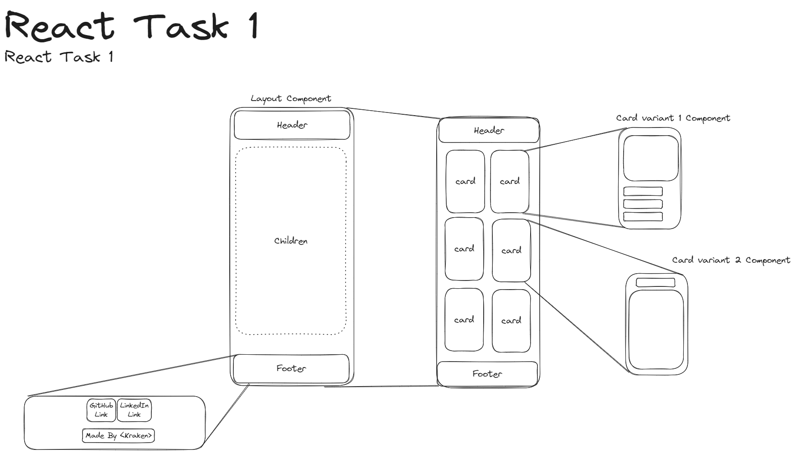

# Modul D Task 1

The first task is simply for setting up a [React] project and learning how to use it to define static (unchanging) components.

## Task

Create a simple Blog Gallery using the [provided data](./src/data/posts.js). Alternativly find your own dataset and display that.

- **Planning**
  1. Import and flesh out this sketch in Figma. It does not need to be detailed, but you need to make decisions about what should be a component, and which variation you want to support.
    

- **Implementation**
  1. Make a fork of this repository or generate a new one with [ViteJS]
  2. Implement the components from your design

- **Optional**
  - Search [NPM] or google for a component library and integrate it in your application
  - Choose your own dataset to render

## Requirements

1. A React Project
2. A Layout component
3. Atleast two different Card components
4. Load the data from the [src/data/posts.js](./src/data/posts.js) file
5. Generate a list of React components from that list

[React]: https://react.dev/
[ViteJS]: https://vitejs.dev/
[NPM]: https://www.npmjs.com/
